<div align="center">

# PEECE

**A midnight members' lounge where you duel the House at cards.**
Four games · three rivals · every deck sealed with SHA-256 before you bet.

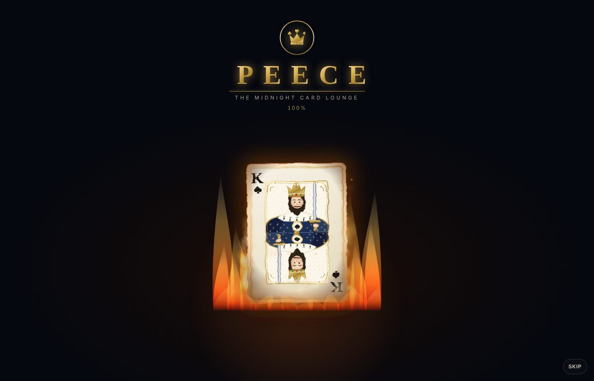

</div>

---

## What it is

PEECE is a play-money card lounge built with plain JavaScript and hand-drawn SVG — no framework, no image files, no backend. You sign the guestbook, pick a game and a rival, and play blind-bet duels for tokens that have **no cash value**.

What makes it different:

- **Every deck is sealed.** Before any bet, the shuffled deck order (and, in The Omen, the secret suit) is hashed with SHA-256 and the hash is shown on the table. After the round, the full deck is revealed, and **Verify** re-hashes it in your browser. If anything changed after you bet, the hash would not match.
- **Real double-entry money.** Every token movement is a ledger row. The Treasury page shows that everything ever minted equals everything held across players, escrow and the house.
- **Rivals with temperament.** The Marquis calculates, the Countess shoves, the Jester bluffs for sport. Each one sees only what a real opponent would see, talks in the chat, and in Liar's Throne remembers how often you've been caught lying.

## The games

| | Game | In one line |
|---|---|---|
| ✉️ | **The Omen** *(flagship)* | A sealed envelope hides a suit. Bet blind, optionally call the suit, and play one card. A right call is +1 rank, a wrong one −1. A 2 slays an Ace. |
| 🂡 | **Vingt Duel** | Head-to-head twenty-one. A Lucky suit is worth +1 per card. Hit and stand in secret, and five cards without busting is a Charlie. |
| 👑 | **Liar's Throne** | The Throne plays a hidden card and claims a band (LOW, MID, COURT or ACE). Believe and pay a share, or call the lie for the full stake. |
| 🃏 | **Three-Card Showdown** | Three cards in Deuce Supreme order (… K A **2**). Hold, raise or fold. Raise against a hold, and the holder must call or fold. |

Full rules with worked examples are in the app under **How to play** and in [`docs/02-game-design.md`](docs/02-game-design.md).

## Screenshots

| The Foyer | The Omen — choosing |
|---|---|
| 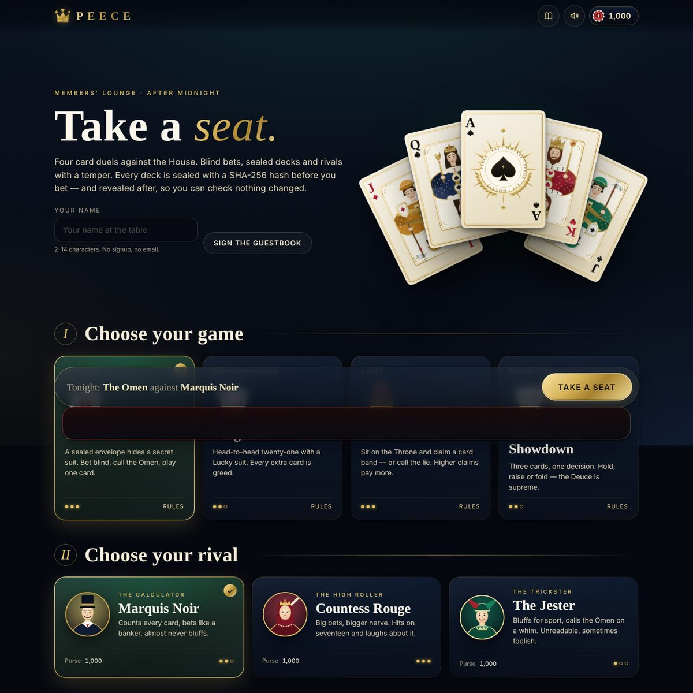 | 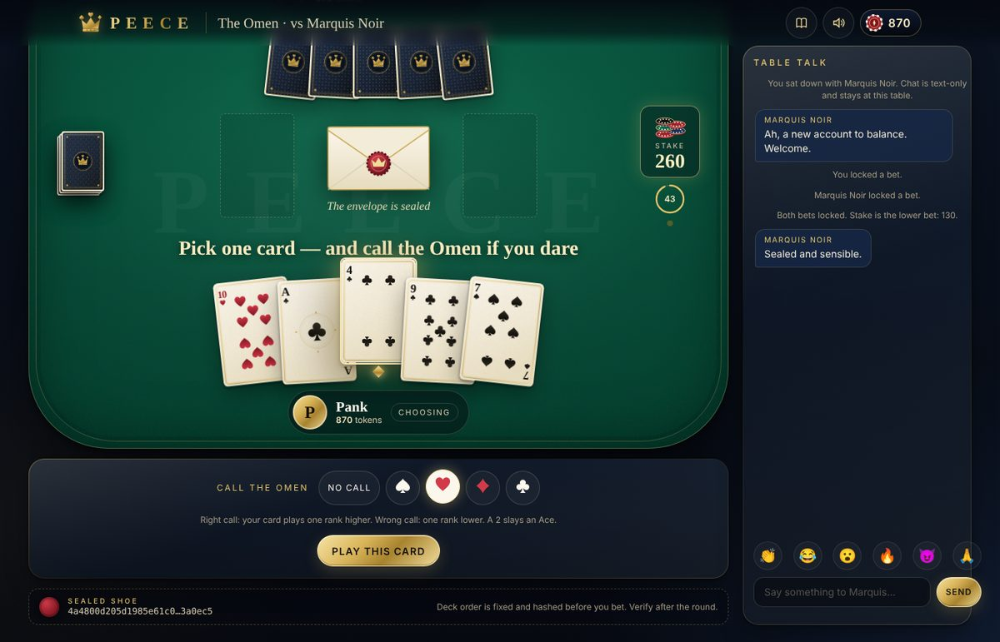 |
| **The Omen — reveal** | **Vingt Duel** |
| 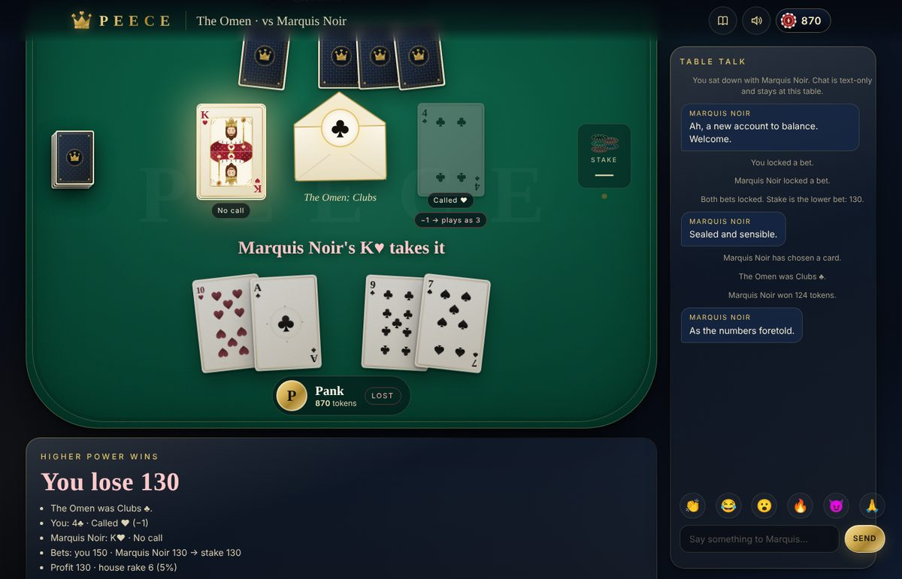 | 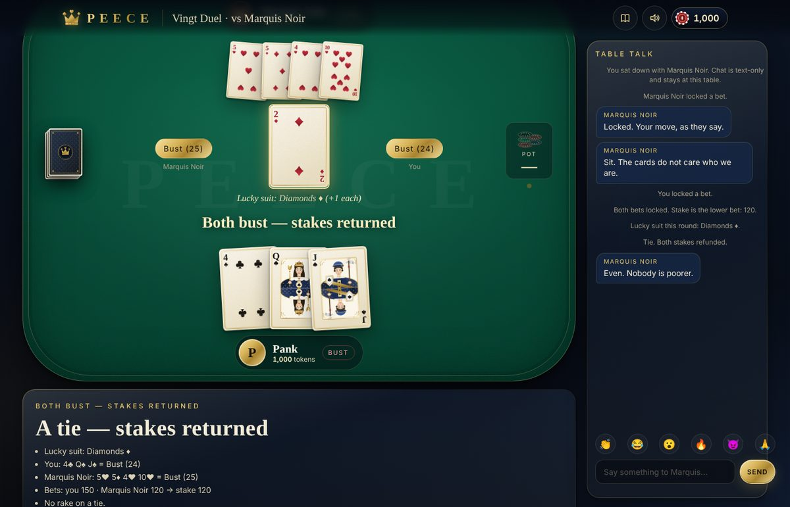 |
| **Liar's Throne** | **Three-Card Showdown** |
| 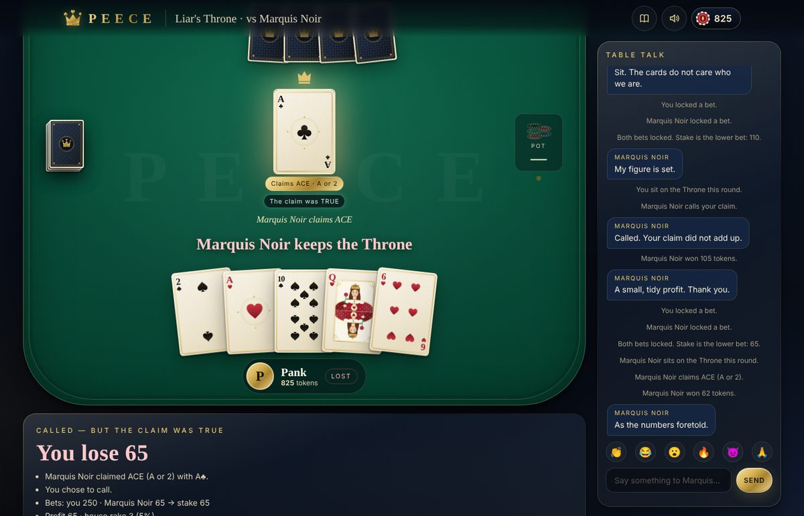 | 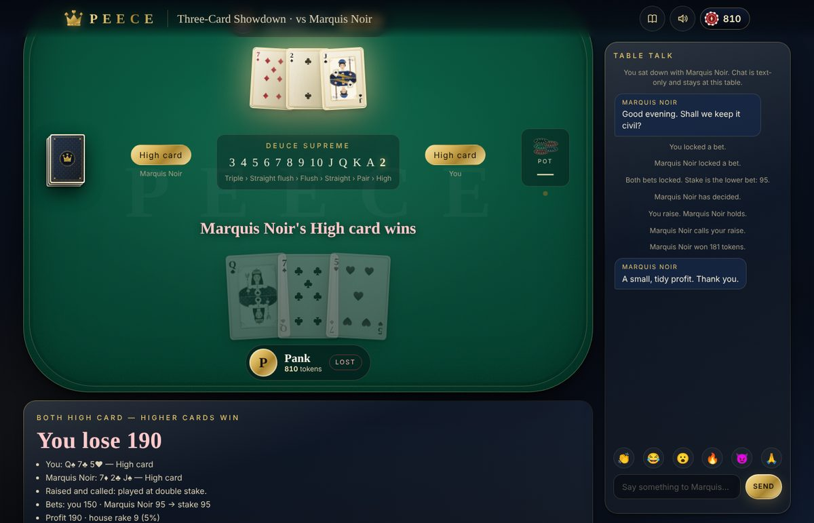 |
| **How to play** | **The Treasury** |
| 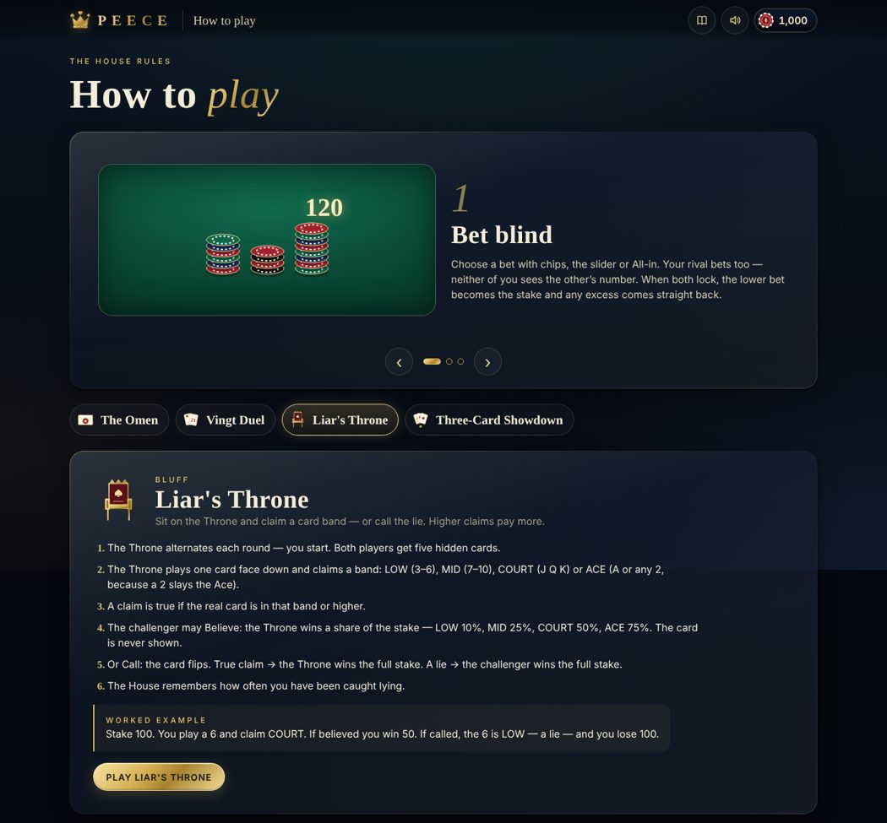 | 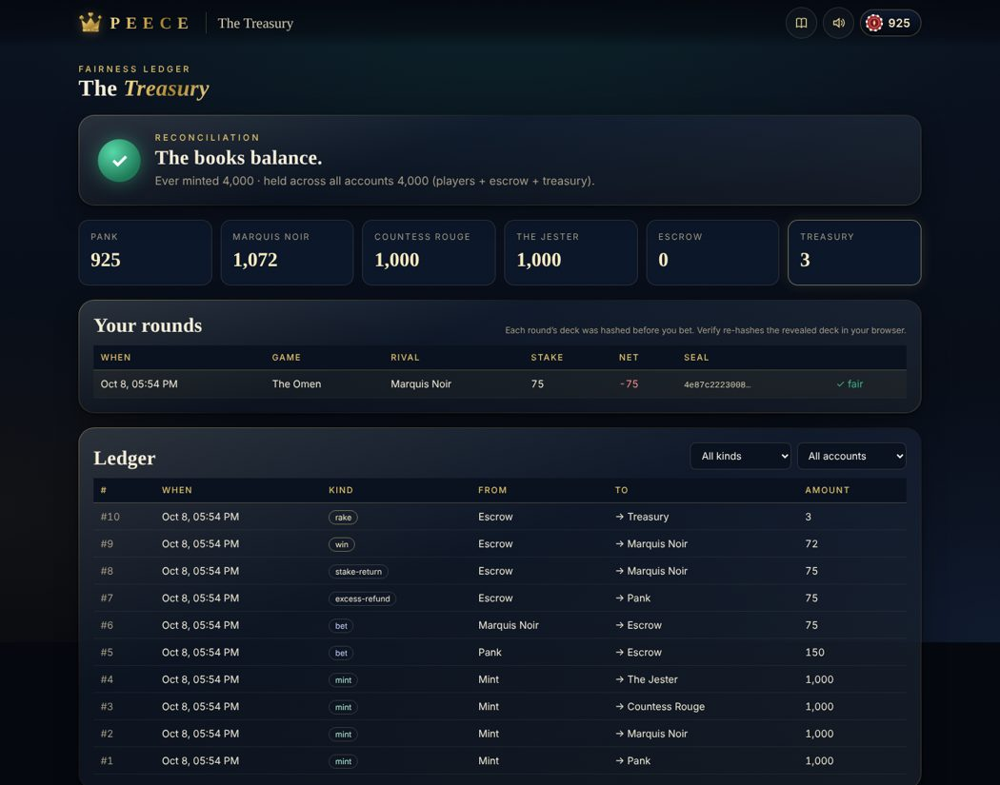 |

<p align="center">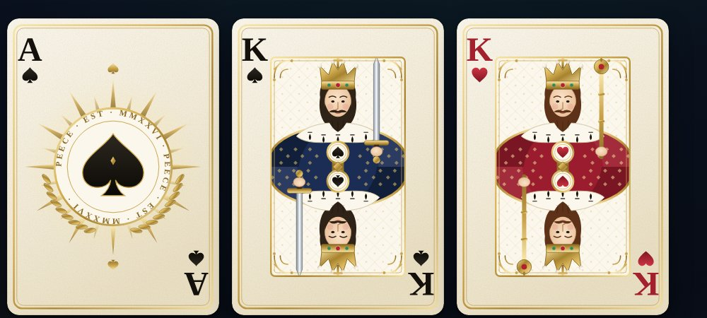</p>
<p align="center">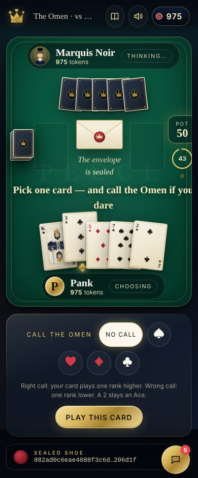</p>

## Money rules

1. Both blind bets go into **escrow** when they lock.
2. **Stake = the lower bet.** Any excess is refunded on the spot, so nobody can win more than they risked.
3. The winner gets their stake back plus their winnings, minus a **5% rake on the winnings** (rounded down), which goes to the house treasury.
4. **Ties refund both stakes**, with no rake.
5. At **0 tokens** you're locked out for **7 days**. The house (the Treasury page) can restore you, and that action is audited.

## Fairness, honestly

- All shuffling and every House decision uses `crypto.getRandomValues` with rejection sampling (no modulo bias). `Math.random()` only touches cosmetic particles.
- The House AI never reads your hand, your call or the Omen. It decides from its own cards and from public history.
- **Honest limit:** this edition runs entirely in your browser, so the code that deals is code you could edit. The seal proves the deck didn't change *after* you bet, but it can't stop someone who rewrites the page. The docs describe a Supabase server version (`docs/03`, `docs/04`) that moves dealing behind row-level security.

## Tech

- **Vite + vanilla JS (ES modules) + CSS.** No framework. All animation uses the Web Animations API and canvas.
- **All 52 cards are generated SVG** (pips, heraldic double-ended courts, a ceremonial Ace of Spades). Each face is built once into a `<symbol>` and reused with `<use>`.
- **Burning-King loader:** a traditional-pattern King of Spades rendered into a WebGL shader that burns it from a noise-shaped front, with an ember rim, char and scorch bands, heat haze, rising flames and smoke. A canvas-fire version is the fallback when WebGL is unavailable.
- **WebAudio-only sound.** Deal, flip, chips, win, lose and seal are synthesised, with a persisted mute.
- **Accessibility:** keyboard play (arrow keys move through your hand), ARIA labels on every card, live-region announcements, and a full `prefers-reduced-motion` path.
- **Tests:** 31 Vitest checks covering money conservation, stake fixing, rake, ties, idempotent settlement, all four rule sets, seat symmetry, hand frequencies and seal tamper detection.

```
src/
├─ engine/        pure game logic: rng, cards, seal, bank, rivals, banter, games/*
├─ cards/         SVG deck: sprite, pips, courts, ace, back, crown, tilt
├─ ui/screens/    loader, lobby (Foyer), table, how-to-play, treasury, dev/cards
├─ ui/games/      omen, vingt, throne, showdown — each exports play(ctx)
├─ ui/components/ header, bet panel, timer ring, chat, toast
├─ fx/            fire, flying chips, win burst, emoji
├─ audio/         WebAudio synth
└─ state/         local persistence (guarded storage)
tests/            engine tests
docs/             full design spec (requirements → QA plan)
```

## Run it

```bash
npm install
npm run dev        # http://localhost:5173
npm test           # engine tests
npm run build      # production build in dist/
```

Hidden extra: `#/dev/cards` shows the whole deck at several sizes.

## Deploy

- **GitHub Pages:** the included workflow (`.github/workflows/pages.yml`) tests, builds and deploys on every push to `main`. Enable it once under **Settings → Pages → Source: GitHub Actions**. The site appears at `https://pankqx.github.io/peece/`.
- **Vercel:** import the repo. `vercel.json` already sets the build, the SPA rewrite and strict security headers (CSP, nosniff, referrer and permissions policies).

## Status

See [`STATUS.md`](STATUS.md) for what's built and what's next.

---

<sub>Play money only. Tokens have no cash value and cannot be bought, sold or withdrawn.</sub>
